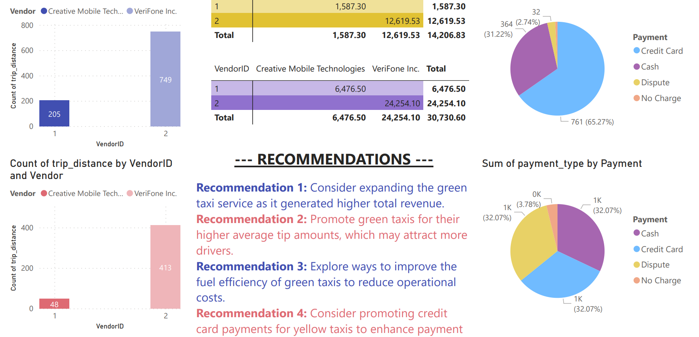

# **NYC Taxi Analysis Project**

## *Overview*
*This project aims to conduct a comprehensive analysis and comparison of green and yellow taxis in New York City. The analysis includes factors such as trip distance, fare amounts, payment types, and customer preferences to provide insights for optimizing taxi services.*

## **Visualization**


## **Project Structure**

- **data/**: This directory contains the sample datasets for Green and Yellow Taxis.
  - *green_taxi_data.csv*: Sample dataset for Green Taxis.
  - *yellow_taxi_data.csv*: Sample dataset for Yellow Taxis.
  
- **notebooks/**: Jupyter notebooks for data cleaning, analysis, and visualization.
  - *data_cleaning.ipynb*: Notebook for data cleaning and preprocessing steps.
  - *data_analysis.ipynb*: Notebook for exploratory data analysis and hypothesis testing.
  - *data_visualization.ipynb*: Notebook for advanced data visualization using Python.

- **power_bi/**: Power BI files for creating visualizations and dashboards.
  - *taxi_analysis.pbix*: Power BI file containing visualizations and dashboards.

- **reports/**: Report files summarizing analysis findings and recommendations.
  - *taxi_analysis_report.txt*: Text file containing analysis findings and recommendations.
  
- **README.md**: The main README file providing an overview of the project and its structure.

## **How to Use**

1. Clone the repository to your local machine:
   ```bash
   git clone https://github.com/shabi340/TaxiAnalysis.git

2. Navigate to the project directory:
   ```bash
   cd nyc_taxi_analysis

3. Follow the steps outlined in the notebooks/ directory for data cleaning, analysis, and visualization.
4. Open the Power BI file (power_bi/taxi_analysis.pbix) to explore the visualizations and dashboards.
5. Review the analysis findings and recommendations in the report file (reports/taxi_analysis_report.txt).


## **Dependencies**
- **Python 3.x/**
- **Jupyter Notebook/**
- **Power BI Desktop/**

## **License**
This project is licensed under the MIT License.

## **Acknowledgements**
The sample datasets used in this project were provided by NYC Gov (https://www.nyc.gov/site/tlc/about/tlc-trip-record-data.page).
